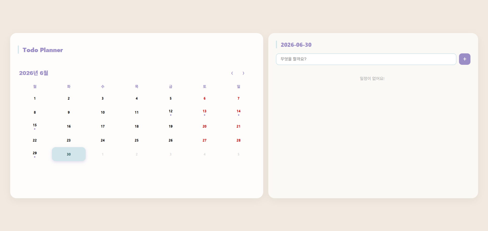
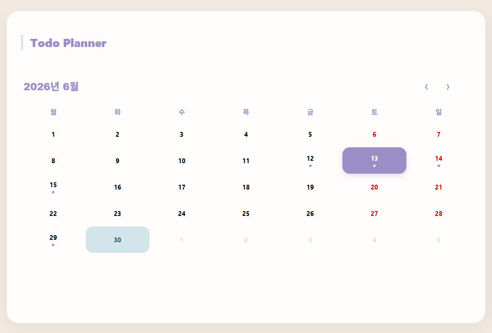
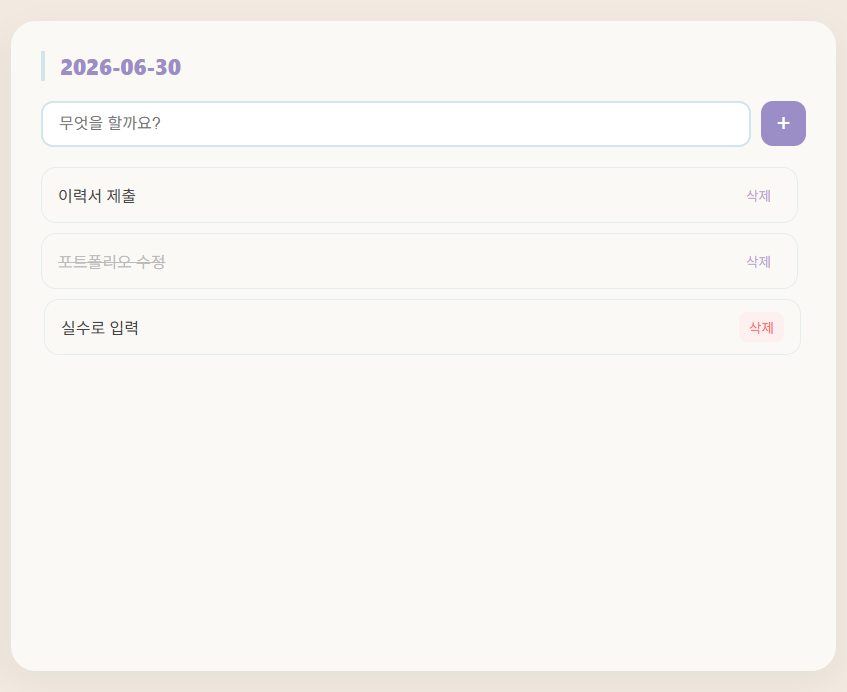

# Todo Planner

> A calendar-based todo app that lets you manage tasks by date — see which days have todos at a glance and keep your schedule organized.

[한국어](README.ko.md)



---

## Features

- **Calendar view** — monthly calendar with dot indicators on dates that have todos
- **Date-based todos** — select any date to view and manage that day's tasks
- **Add todos** — type and press Enter or click `+` to add a task
- **Complete todos** — click a task to toggle completion
- **Delete todos** — remove tasks individually
- **Persistent storage** — todos are saved to localStorage and persist across sessions

## Screenshots

### Calendar with Todo Indicators



Dates with todos show a dot so you can see your busy days at a glance.

### Managing Todos



Select a date on the calendar to view, add, complete, or delete that day's tasks.

## Tech Stack

| Layer | Technology |
|---|---|
| Language | TypeScript |
| UI Framework | React |
| Build Tool | Vite |
| Calendar | [react-calendar](https://github.com/wojtekmaj/react-calendar) |
| Styling | CSS Modules |
| Storage | localStorage |

## Getting Started

### Prerequisites

- Node.js
- npm

### Installation

```bash
npm install
```

### Development

```bash
npm run dev
```

### Build

```bash
npm run build
```

## Deployment

This project includes a [vercel.json](vercel.json) for deployment on [Vercel](https://vercel.com/).